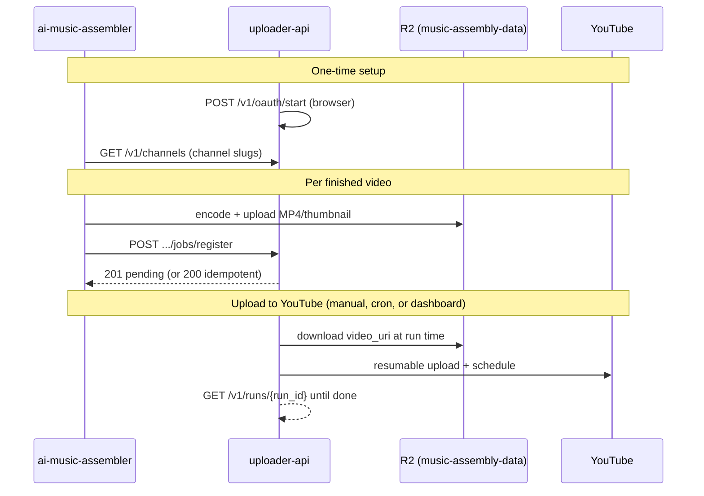

# YouTube Uploader

Standalone microservice that uploads pre-rendered videos to YouTube, schedules publish times, and supports multiple YouTube channels. Split from **ai-music-assembler**, which handles video rendering only.

## What it does

- **Dynamic channel registration** — `uploader channel add` (OAuth by YouTube name / @handle)
- YouTube OAuth (`.env` or client secret JSON; one refresh token per channel)
- Resumable video upload via YouTube Data API v3
- Custom thumbnail upload (best-effort; never fails the video upload)
- Schedule publish with `publishAt` (RFC3339 UTC)
- Upload registry queue: `pending` → `uploading` → `uploaded` | `failed`
- Batch processing with staggered publish times
- Retry transient failures (timeouts, 408/429/5xx) with linear backoff
- List channel videos; filter to scheduled only
- Multi-channel via `config/channels.yaml`
- **Assembly categories** — saved labels per channel (e.g. `korean`), separate from YouTube video `category_id`
- **Web dashboard** — manage categories, connect/remove channels, assign categories, upload queue
- Resolve video/thumbnail/description from local paths, `file://`, or `s3://` URIs
- **Cloudflare R2** — durable storage for config, OAuth tokens, registries, and video jobs

## What it does not do

- No FFmpeg, encoding, or thumbnail generation
- No title/description generation (receives final strings from upstream)

## Quick start

### 1. Install

```bash
python -m venv .venv
.venv\Scripts\activate          # Windows — required for `uploader` command
pip install -e ".[s3,dev]"
uploader --version                # verify CLI is available
```

All commands below use `uploader …`. If the command is not found, activate `.venv` first or run `.\.venv\Scripts\uploader.exe …`.

On **Windows**, `tzdata` is installed automatically (required for publish timezone scheduling).

### 2. Configure

```bash
cp .env.example .env
cp config/channels.yaml.example config/channels.yaml
```

Edit `.env` with Google OAuth vars and (optionally) Cloudflare R2 credentials.

### 3. Google Cloud setup

1. Create a Google Cloud project and enable **YouTube Data API v3**
2. Configure the OAuth consent screen
3. Create a **Web application** OAuth client
4. Register redirect URIs (no trailing slash): `http://localhost:8765` and `http://127.0.0.1:8765`
5. Set `GOOGLE_CLIENT_ID`, `GOOGLE_CLIENT_SECRET`, `GOOGLE_PROJECT_ID` in `.env`

### 4. Cloudflare R2 (recommended for production)

```env
CLOUDFLARE_R2_BUCKET=your-bucket
CLOUDFLARE_R2_ENDPOINT_URL=https://<account_id>.r2.cloudflarestorage.com
CLOUDFLARE_R2_REGION=auto
CLOUDFLARE_R2_ACCESS_KEY_ID=...
CLOUDFLARE_R2_SECRET_ACCESS_KEY=...
```

Create an R2 API token with **Object Read & Write** scoped to your bucket only.

Initialize the bucket layout and migrate any local data:

```bash
uploader storage init
```

### 5. Authorize a channel

```bash
uploader channel add
```

Sign in via browser as the YouTube channel owner. The service saves:

- OAuth token → `secrets/{channel_id}/youtube_token.json` (in R2 when configured)
- Channel metadata → `state/{channel_id}/channel.meta.json`
- Empty upload queue → `state/{channel_id}/upload_registry.txt`
- Channel entry → `config/channels.yaml`

Channel id is derived from the @handle or channel name (e.g. `justcavefire`).

**Assembly categories** (optional) — labels for grouping channels with your content pipeline. Manage via dashboard **Categories** or API `GET/POST/DELETE /v1/categories`. Stored in `channels.yaml`:

```yaml
categories:
  - korean
  - lofi
channels:
  - id: justcavefire
    name: Just Cave Fire
    category: korean          # assembly label (not YouTube category_id)
    category_id: "10"       # YouTube video category for uploads
```

### 6. Test upload

```bash
uploader test --channel justcavefire --video ./test.mp4
```

### 7. Stage a video and run batch uploads

```bash
# Upload video files to R2 queue + register as pending
uploader queue add --channel justcavefire \
  --video ./my-video.mp4 \
  --title "My Video" \
  --description "Description text" \
  --thumbnail ./thumb.png

uploader plan --channel justcavefire
uploader run --channel justcavefire --upload-retries 5
uploader list --channel justcavefire --scheduled-only
```

**Production upload flow:** `queue add` (stage to R2) → `run` (upload to YouTube). Files move from `queue/` to `uploaded/` after success.

## HTTP API + web UI (local)

Run the FastAPI server with a simple dashboard (channels, queue, upload triggers, OAuth):

```bash
pip install -e ".[api,s3,dev]"
uploader-api
# open http://127.0.0.1:8000
```

Interactive API docs: http://127.0.0.1:8000/docs

**OAuth for the API:** add this redirect URI in Google Cloud Console (Web application client):

`http://127.0.0.1:8000/v1/oauth/callback`

Set `UPLOADER_API_PUBLIC_URL=http://127.0.0.1:8000` in `.env` if using a different host/port.

**Cloud Run:** see [deploy/cloud-run.md](deploy/cloud-run.md) for Dockerfile, `gcloud` deploy, and production env vars.

The dashboard uses **`GET /v1/dashboard`** (one request for channels, categories, and queue). In-memory caching keeps repeat loads fast (~100ms vs ~20s before optimization).

**Dashboard sections:** **Categories** (create/delete saved labels) · **Connect YouTube channel** (OAuth + optional category) · **Channels** (category dropdown, upload, reauth, remove) · **Queue** / **Uploaded**

**Cache invalidation** (automatic — no manual flush needed):

| Event | What refreshes |
|-------|----------------|
| `queue add` / `queue remove` / upload run | Queue + dashboard |
| OAuth connect / reauth | Config + tokens + dashboard |
| Category create/delete or channel category PATCH | Config + dashboard |
| `write_raw_config` / `channel add` | Config + dashboard |
| TTL expiry (fallback) | Dashboard 60s, config 120s, tokens 300s |

Use **Refresh** in the UI (calls `?refresh=true`) to force reload from R2. Routine API reads skip expensive R2 sync/migrate; use `uploader storage init` for full sync.

### Quick reference

| Endpoint | Description |
|----------|-------------|
| `GET /v1/categories` | List saved assembly categories |
| `POST /v1/categories` | Create category `{ "name": "korean" }` |
| `GET /v1/channels` | All channels with OAuth status, counts, and `category` |
| `GET /v1/youtube/channels` | Upload-ready channels only (valid OAuth) |
| `PATCH /v1/channels/{ref}` | Assign category `{ "category": "korean" }` or clear with `""` |
| `DELETE /v1/channels/{ref}` | Disconnect channel (keeps queue data in R2) |
| `POST /v1/channels/{id}/jobs` | **Add video to queue** — multipart upload (AI pipelines) |
| `GET /v1/jobs?status=pending` | List pending upload queue |
| `POST /v1/channels/{id}/runs` | Upload queued videos to YouTube |
| `GET /v1/dashboard` | Categories + channels + queue + history (cached) |

Full endpoint catalog: [`api/endpoint_docs.py`](api/endpoint_docs.py) (also returned by `GET /v1/capabilities`).

### HTTP API reference

Canonical descriptions live in `api/endpoint_docs.py` and appear in OpenAPI at **`/docs`** (Swagger UI) and **`/redoc`**. Each operation includes purpose, curl usage, and example JSON responses. Machine-readable catalog: `GET /v1/capabilities`.

#### Health & discovery

| Method | Path | Description |
|--------|------|-------------|
| GET | `/v1/health` | Liveness check — returns `{ status, version }` |
| GET | `/v1/capabilities` | CLI commands, YouTube features, and all API routes with summaries |

#### Dashboard & channels

| Method | Path | Description |
|--------|------|-------------|
| GET | `/v1/dashboard` | Categories + all channels + `queue_jobs` + `uploaded_jobs` (`?refresh=true` to bypass cache) |
| GET | `/v1/channels` | List channels with OAuth status, counts, and `category` |
| GET | `/v1/youtube/channels` | Upload-ready channels only (valid OAuth; includes `category`) |
| GET | `/v1/channels/{ref}` | Single channel (ref = id, name, `@handle`, or YouTube channel id) |
| PATCH | `/v1/channels/{ref}` | Assign assembly `category` (must exist in `/v1/categories`) or clear with `""` |
| DELETE | `/v1/channels/{ref}` | Remove channel from uploader (disconnect OAuth; keeps queue/upload data) |

#### Assembly categories

Saved in `channels.yaml` as a top-level `categories:` list. Distinct from YouTube video `category_id` (default `"10"`).

| Method | Path | Description |
|--------|------|-------------|
| GET | `/v1/categories` | List saved categories (deduplicated) |
| POST | `/v1/categories` | Create category — body `{ "name": "korean" }` (rejects duplicates) |
| DELETE | `/v1/categories/{name}` | Delete category and clear it from any channels using it |

Dashboard: use the **Categories** section to create/delete; assign via dropdown on each channel row or when connecting OAuth.

#### Jobs — queue ingest & management

| Method | Path | Description |
|--------|------|-------------|
| GET | `/v1/jobs` | List jobs — `?channel=`, `?status=pending\|uploaded\|failed`, `?location=queue\|uploaded\|all` |
| **POST** | **`/v1/channels/{ref}/jobs`** | **Stage video into queue/** — multipart: `video`, `title`, optional metadata (see below) |
| POST | `/v1/jobs` | Same as above; pass `channel_id` in form body |
| POST | `/v1/channels/{ref}/jobs/register` | Register when video already on R2 — JSON with `video_uri`, `title`, metadata |
| GET | `/v1/channels/{ref}/jobs/{job_id}` | Job detail + `metadata.json` (`?media=true` for preview URLs) |
| GET | `/v1/channels/{ref}/jobs/{job_id}/media/{video\|thumbnail}` | Stream or redirect to queued media file |
| DELETE | `/v1/channels/{ref}/jobs/{job_id}` | Remove from queue (deletes `queue/` folder + registry row) |

#### Upload runs & YouTube

| Method | Path | Description |
|--------|------|-------------|
| GET | `/v1/channels/{ref}/plan` | Preview publish schedule for pending jobs |
| POST | `/v1/channels/{ref}/runs` | Start background YouTube upload — body: `{ "count": 1 }` or omit for all |
| GET | `/v1/runs/{run_id}` | Poll run progress (uploaded count, URLs, errors) |
| POST | `/v1/runs/all` | Upload pending jobs for every channel |
| GET | `/v1/channels/{ref}/youtube/videos` | List videos on YouTube (`?scheduled_only=true`) |

#### OAuth & storage

| Method | Path | Description |
|--------|------|-------------|
| POST | `/v1/oauth/start` | Start browser OAuth to add a channel — optional body `{ "category": "korean" }` |
| POST | `/v1/channels/{ref}/oauth/start` | Re-authenticate an existing channel |
| POST | `/v1/storage/init` | Create R2 bucket layout (`uploader storage init`) |

#### Auth for hosted deployments

Set **both** for production:

```env
UPLOADER_API_KEY=your-long-random-api-token
UPLOADER_DASHBOARD_PASSWORD=your-dashboard-password
UPLOADER_SESSION_SECURE=1
```

| Who | How to authenticate |
|-----|---------------------|
| **You (browser)** | Visit `/login` → enter dashboard password → session cookie |
| **AI pipeline / assembler** | `X-API-Key: your-long-random-api-token` or `Authorization: Bearer ...` |
| **Load balancer** | `GET /v1/health` (always public) |

When either env var is set, all routes except `/v1/health`, `/login`, and `/v1/oauth/callback` require authentication.

Sign out from the dashboard with the **Sign out** button, or `POST /logout`.

Leave both unset for local dev (no auth).

## Upload flow — required endpoints

A video reaches YouTube in **two steps**: **queue** (stage/register) then **run** (upload to YouTube). Register alone does not publish anything.



### Endpoint checklist

| Step | Who calls | Method | Path | Required? | Purpose |
|------|-----------|--------|------|-----------|---------|
| **1. Discover channels** | Assembler dashboard | `GET` | `/v1/channels` | Recommended | Returns `channels[].id` slugs (`nappabeats`, `justcavefire`, …) used in register URL and R2 paths |
| **2. Queue job** | Assembler (`ASSEMBLY_QUEUE_YOUTUBE`) | `POST` | `/v1/channels/{channel_ref}/jobs/register` | **Yes** | Append `pending` registry row; validate `video_uri` exists in R2 |
| **3. Upload to YouTube** | Operator, cron, or dashboard | `POST` | `/v1/channels/{channel_ref}/runs` | **Yes** | Download MP4 from `video_uri`, upload to YouTube, set `publishAt` |
| **4. Poll run** | Whoever started the run | `GET` | `/v1/runs/{run_id}` | Recommended | `status`, `uploaded`, `urls`, `errors` until `completed` |
| **5. Verify queue** | Ops / debugging | `GET` | `/v1/jobs?channel={ref}&status=pending` | Optional | Confirm job is queued before/after run |

**One-time setup (not per video):**

| Step | Who | Method | Path | Purpose |
|------|-----|--------|------|---------|
| Connect YouTube OAuth | Human (browser) | `POST` | `/v1/oauth/start` | Save refresh token per channel — **required before step 3 works** |
| Check assembler R2 access | Ops | `GET` | `/v1/capabilities` | `assembly_integration.assembly_r2.reachable` must be `true` for cross-bucket URIs |
| Health | Load balancer | `GET` | `/v1/health` | Liveness (no auth) |

**Auth header on steps 1–4 (hosted):** `X-API-Key: $UPLOADER_API_KEY`

---

### Step 2 — Register (assembler)

Called automatically when `ASSEMBLY_QUEUE_YOUTUBE=true` (or `--queue-youtube`). **Does not upload to YouTube.**

```
POST /v1/channels/{channel_ref}/jobs/register
Content-Type: application/json
X-API-Key: $UPLOADER_API_KEY
```

`{channel_ref}` must match `channels[].id` from `GET /v1/channels` (e.g. `nappabeats`).

**Request body (assembler sends today):**

```json
{
  "job_id": "mv_20260624_061500",
  "title": "Generated YouTube title",
  "description": "Full description with chapter timestamps",
  "video_uri": "s3://music-assembly-data/music-video/nappabeats/mv_20260624_061500/mv_20260624_061500_video.mp4",
  "thumbnail_uri": "s3://music-assembly-data/music-video/nappabeats/mv_20260624_061500/mv_20260624_061500_thumbnail.png"
}
```

| Field | Required | Notes |
|-------|----------|-------|
| `title` | Yes | YouTube title |
| `video_uri` | Yes | `s3://` URI — assembler bucket (`music-assembly-data`) or uploader bucket |
| `job_id` | Recommended | Run folder basename (`mv_YYYYMMDD_HHMMSS`); idempotent key |
| `description` | No | Inline text (not a URI) |
| `thumbnail_uri` | No | `s3://` PNG/JPG |

**Responses:** `201` new job · `200` same `job_id` + `video_uri` (idempotent) · `404` unknown channel · `409` same `job_id`, different `video_uri` · `400`/`502` file missing or R2 access denied

---

### Step 3 — Run (upload to YouTube)

**Required to actually publish.** Channel must have `auth.valid: true` (OAuth connected).

```
POST /v1/channels/{channel_ref}/runs
Content-Type: application/json
X-API-Key: $UPLOADER_API_KEY

{"count": 1, "upload_retries": 5}
```

| Field | Default | Notes |
|-------|---------|-------|
| `count` | all pending | Upload oldest N jobs (`1` = one video) |
| `upload_retries` | `3` | Retries on 408/429/5xx |
| `no_schedule` | `false` | `true` = publish immediately (private until live) |
| `privacy` | channel/job default | Override per run |

**Response:** `202` with `run_id`. Poll:

```
GET /v1/runs/{run_id}
```

When `status` is `completed`, check `urls` for `https://youtu.be/...` and `errors` for failures.

**Cron example (Cloud Scheduler, one channel per job):**

```bash
curl -X POST "$UPLOADER_API_URL/v1/channels/nappabeats/runs" \
  -H "X-API-Key: $UPLOADER_API_KEY" \
  -H "Content-Type: application/json" \
  -d '{"count": 1, "upload_retries": 5}'
```

Upload all channels: `POST /v1/runs/all` (same body).

---

### Alternative: multipart queue (not assembler)

For small files or local dev only (Cloud Run **32 MB** body limit):

```
POST /v1/channels/{channel_ref}/jobs    # multipart: video + title
POST /v1/channels/{channel_ref}/runs   # same as step 3
```

---

### Environment required for cross-bucket assembler URIs

```env
ASSEMBLY_R2_BUCKET=music-assembly-data
# Option A: uploader R2 token has read access to both buckets (no extra keys)
# Option B: dedicated read credentials:
# ASSEMBLY_R2_ENDPOINT_URL=...
# ASSEMBLY_R2_ACCESS_KEY_ID=...
# ASSEMBLY_R2_SECRET_ACCESS_KEY=...
```

Verify: `GET /v1/capabilities` → `assembly_integration.assembly_r2.reachable: true`

---

### AI video pipeline integration

Use the API at the end of your generator pipeline to push finished videos into the upload queue. No YouTube OAuth is required for **register** — only for **`POST .../runs`**.

See **[Upload flow — required endpoints](#upload-flow--required-endpoints)** above for the full checklist.

**Option A — upload the file directly (simplest, local/small files)**

```bash
curl -X POST "http://127.0.0.1:8000/v1/channels/justcavefire/jobs" \
  -F "video=@./output.mp4" \
  -F "title=My Generated Video" \
  -F "description=Created by my AI pipeline" \
  -F "privacy=private" \
  -F "is_short=false" \
  -F "tags=ai,generated"
```

Returns `201` with `job_id`, `video_uri`, `queue_prefix`, and registry path. Then call `POST /v1/channels/justcavefire/runs` with `{"count": 1}`.

**Option B — ai-music-assembler auto-queue (production)**

When `ASSEMBLY_QUEUE_YOUTUBE=true`, the assembler calls **step 2 only** (`POST .../jobs/register`). An operator or cron must call **step 3** (`POST .../runs`) to upload to YouTube.

```bash
curl -X POST "$UPLOADER_API_URL/v1/channels/nappabeats/jobs/register" \
  -H "X-API-Key: $UPLOADER_API_KEY" \
  -H "Content-Type: application/json" \
  -d '{
    "job_id": "mv_20260624_061500",
    "title": "Generated title",
    "description": "Chapter timestamps…",
    "video_uri": "s3://music-assembly-data/music-video/nappabeats/mv_20260624_061500/mv_20260624_061500_video.mp4",
    "thumbnail_uri": "s3://music-assembly-data/music-video/nappabeats/mv_20260624_061500/mv_20260624_061500_thumbnail.png"
  }'
```

Configure assembler bucket access in `.env` (see `ASSEMBLY_R2_*` in `.env.example`). Either grant the uploader R2 token read access to both buckets, or set dedicated `ASSEMBLY_R2_ACCESS_KEY_ID` credentials.

Re-posting the same `job_id` is **idempotent** (`200`, no duplicate). **You must still call** `POST /v1/channels/nappabeats/runs` `{"count": 1}` to upload to YouTube.

Check `GET /v1/capabilities` → `assembly_integration.assembly_r2` for bucket reachability.

**Option B (same bucket)** — if your generator uploads directly to the uploader R2 bucket:

```bash
curl -X POST "http://127.0.0.1:8000/v1/channels/justcavefire/jobs/register" \
  -H "Content-Type: application/json" \
  -d '{
    "title": "My Generated Video",
    "description": "...",
    "video_uri": "s3://youtuber-uploader/queue/justcavefire/my_job_id/video.mp4",
    "job_id": "my_job_id",
    "privacy": "private",
    "is_short": true,
    "tags": ["ai", "shorts"]
  }'
```

The service validates the file exists, writes metadata sidecars (`metadata.json`, `title.txt`, …), and appends a `pending` registry row.

**Error responses**

| Status | Meaning |
|--------|---------|
| `201` | Job staged successfully |
| `200` | Idempotent re-register (same `job_id` + `video_uri`) |
| `400` | Missing/empty video or file not found |
| `404` | Unknown channel |
| `409` | Duplicate `job_id` with different `video_uri` |
| `422` | Invalid metadata (e.g. bad privacy value) |
| `502` | Storage/R2 failure (including assembler bucket access denied) |

Set `UPLOADER_API_KEY` in `.env` and pass `X-API-Key: ...` on ingest routes when exposing the API beyond localhost.

The CLI remains available for scripting and debugging.

## CLI reference

Channel reference (`<ref>`) can be config id, display name, `@handle`, or YouTube channel id.

### Global

| Command | Description |
|---------|-------------|
| `uploader --version` | Print version |
| `uploader --config PATH` | Use alternate `channels.yaml` (any subcommand) |

### Channels & auth

| Command | Description |
|---------|-------------|
| `uploader channel add` | OAuth in browser; save channel by @handle or name |
| `uploader channel add --category korean` | Same, with assembly category (must exist in `categories:` list) |
| `uploader channel list` | List configured channels, categories, and token paths |
| `uploader channel reauth <ref>` | Re-authenticate one channel |
| `uploader channels` | Alias for `uploader channel list` |

### Storage (Cloudflare R2)

| Command | Description |
|---------|-------------|
| `uploader storage init` | Create bucket layout; migrate local config/tokens/registries to R2 |

### Queue — stage videos for scheduled upload

| Command | Description |
|---------|-------------|
| `uploader queue add` | Upload video + metadata to `queue/{channel}/{job_id}/` and append a `pending` registry row |
| `uploader queue list --channel <ref>` | Show how many pending jobs are in the queue (job ids + titles) |
| `uploader queue list` | Pending counts for every configured channel |
| `uploader queue upload --channel <ref>` | Upload the oldest pending job (default `--count 1`) |
| `uploader queue upload --channel <ref> --count N` | Upload up to N oldest pending jobs (caps at queue size) |
| `uploader queue remove --channel X --id JOB_ID` | Delete job folder from `queue/` and remove its registry row |

**`queue add` options:**

| Flag | Required | Description |
|------|----------|-------------|
| `--channel <ref>` | yes | Target YouTube channel |
| `--video PATH` | yes | Local `.mp4` file |
| `--title TEXT` | yes | YouTube title |
| `--description TEXT` | no | Inline text or path to `.txt` file |
| `--thumbnail PATH` | no | Local thumbnail image |
| `--id JOB_ID` | no | Job id (default: auto-generated) |
| `--privacy` | no | Override default privacy (see below) |
| `--short` / `--no-short` | no | Override default Short flag |
| `--tags a,b,c` | no | Override default tags |
| `--category-id ID` | no | Override default category |
| `--made-for-kids` / `--not-made-for-kids` | no | Override made-for-kids default |
| `--language CODE` | no | Override default language |
| `--metadata PATH` | no | Merge fields from a `metadata.json` file |

**`queue upload` options:** `--count N` (default `1`), `--start`, `--interval-hours`, `--no-schedule`, `--privacy`, `--upload-retries`, `--retry-delay`, `--tags`. If `--count` exceeds pending jobs, only available jobs are uploaded (no error).

**Tip:** run `uploader queue list --channel <ref>` first to see how many videos are waiting.

**Default metadata** (when flags are omitted on `queue add`), applied in order:

1. Built-in: `private`, not a Short, category `10`, not made for kids, language `en`, **no tags**
2. `.env`: `UPLOADER_DEFAULT_PRIVACY`, `UPLOADER_DEFAULT_IS_SHORT`, etc.
3. `channels.yaml` root `defaults:`
4. Per-channel: `upload_defaults:` or `default_tags`, `category_id`, …
5. CLI flags (highest priority)

**`run` / `run-all`:** omit `--privacy` to use each job's `metadata.json` privacy.

**Default publish scheduling** (for `plan`, `run`, `queue upload`, `run-all` — unless `--no-schedule`):

Per-channel `publish:` block in `channels.yaml` (defaults: `America/New_York`, hour `9`, `interval_hours: 24`):

| Setting | Default | Effect |
|---------|---------|--------|
| First video | Tomorrow at channel `hour` | Sets YouTube `publishAt` (video uploads private now) |
| Each additional job in batch | + `interval_hours` | Staggered publish times |
| `--no-schedule` | — | No `publishAt`; uses metadata privacy immediately |

Preview: `uploader plan --channel justcavefire`

### Scheduler — batch upload from registry

| Command | Description |
|---------|-------------|
| `uploader plan --channel <ref>` | Preview publish times for pending jobs (no upload) |
| `uploader run --channel <ref>` | Upload all pending jobs for one channel |
| `uploader run --channel <ref> --limit 1` | Same as `queue upload` |
| `uploader run-all` | Upload all pending jobs for every channel |

**Shared options for `plan`, `run`, `run-all`:**

| Flag | Description |
|------|-------------|
| `--start "YYYY-MM-DD HH:MM"` | First publish time (default: tomorrow at channel publish hour) |
| `--interval-hours N` | Hours between videos (default: from `channels.yaml`) |
| `--limit N` | Process at most N pending jobs |
| `--no-schedule` | Upload without `publishAt` scheduling |

**`run` / `run-all` only:**

| Flag | Default | Description |
|------|---------|-------------|
| `--privacy` | job metadata | Override `metadata.json` privacy on run |
| `--upload-retries N` | `3` | Retries for transient API errors |
| `--retry-delay SEC` | `30` | Base delay between retries (× attempt) |
| `--tags a,b,c` | channel default | Override YouTube tags |

On success, job files move from `queue/` → `uploaded/` in R2.

### Direct upload (bypass registry)

| Command | Description |
|---------|-------------|
| `uploader test --channel <ref> --video PATH` | Quick private upload with auto-generated title/description |
| `uploader upload --channel <ref> --video PATH` | Single upload with optional title/description |

**`test` / `upload` options:**

| Flag | Description |
|------|-------------|
| `--thumbnail PATH` | Thumbnail path or URI |
| `--title TEXT` | Title (`upload` only; default: generated) |
| `--description TEXT` | Description (`upload` only; default: generated) |
| `--privacy` | `private` / `unlisted` / `public` (`upload` only) |
| `--no-schedule` | Skip `publishAt` (`upload` only) |
| `--reauth` | Force OAuth account picker before upload |

### YouTube listing

| Command | Description |
|---------|-------------|
| `uploader list --channel <ref>` | List videos on the YouTube channel |
| `uploader list --channel <ref> --scheduled-only` | Scheduled/private uploads only |

### Registry (advanced / testing)

| Command | Description |
|---------|-------------|
| `uploader enqueue ...` | Append a pending row when video files already exist at URIs |

**`enqueue` options:** `--channel`, `--id`, `--video`, `--title`, `--description`, `--thumbnail`

Prefer `queue add` when starting from local files — it uploads to R2 and registers in one step.

### Typical workflows

**First-time setup:**
```bash
uploader storage init
uploader channel add
uploader test --channel justcavefire --video ./test.mp4
```

**Production pipeline:**
```bash
uploader queue add --channel justcavefire --video ./video.mp4 --title "..." --description "..."
uploader queue list --channel justcavefire          # see pending count
uploader plan --channel justcavefire              # preview publish times
uploader queue upload --channel justcavefire        # upload 1 (oldest pending)
# or upload all pending:
uploader run --channel justcavefire --upload-retries 5
```

**Daily cron (all channels):**
```bash
uploader run-all --upload-retries 5
```

## Cloudflare R2 bucket layout

When `CLOUDFLARE_R2_BUCKET` is set, **R2 is the source of truth** for `config/channels.yaml`. The API and CLI read from `s3://{bucket}/config/channels.yaml` on every request, mirror a copy to local `config/channels.yaml`, and write changes back to R2. If a channel has `state/{channel_id}/` in R2 but is missing from the yaml, it is auto-discovered from `channel.meta.json` and added to the config.

All durable state lives in R2 (local `config/` and `secrets/` are mirrored for convenience):

```
{bucket}/
├── config/channels.yaml          # channels + categories: list + google/oauth settings
├── secrets/{channel_id}/youtube_token.json
├── state/{channel_id}/channel.meta.json
├── state/{channel_id}/upload_registry.txt   # JSON-lines job queue + history
├── queue/{channel_id}/{job_id}/             # pending YouTube uploads
│   ├── video.mp4
│   ├── thumbnail.png          # optional
│   ├── title.txt
│   ├── description.txt
│   ├── metadata.json          # privacy, is_short, tags, category_id, made_for_kids, …
│   ├── privacy.txt            # private | unlisted | public
│   ├── is_short.txt           # true | false
│   └── manifest.json          # staging summary + URIs
├── uploaded/{channel_id}/{job_id}/          # moved here after successful upload
└── logs/{channel_id}/                       # cron logs
```

Legacy prefixes `videos/` and `archive/` are still read for older jobs.

**Stage a video into the queue:**

```bash
uploader queue add --channel justcavefire \
  --video ./my-video.mp4 \
  --title "My Video Title" \
  --description "Description text or path/to/description.txt" \
  --thumbnail ./thumb.png \
  --id my-job-001
```

Then cron or `uploader run` picks up pending jobs and moves files to `uploaded/` after YouTube upload.

Path helpers for upstream services (assembler):

```python
from pathlib import Path
from uploader.bucket_layout import default_job_uris, JOB_VIDEO

uris = default_job_uris("justcavefire", "job-2026-06-18-001", Path("."))
# uris["video_uri"], uris["thumbnail_uri"], uris["job_prefix"], ...
```

## Multi-channel cron

Per channel (staggered — recommended):

```cron
0 3 * * * /path/to/youtube-uploader/scripts/run-channel.sh justcavefire
0 4 * * * /path/to/youtube-uploader/scripts/run-channel.sh mmmactually
```

All channels at once:

```cron
0 3 * * * /path/to/youtube-uploader/scripts/run-all-channels.sh
```

Windows: use `scripts/run-channel.ps1` or `scripts/run-all-channels.ps1` with Task Scheduler.

## Registry format

JSON-lines at `state/{channel_id}/upload_registry.txt`:

```json
{
  "id": "job-2026-06-18-001",
  "channel_id": "justcavefire",
  "status": "pending",
  "title": "YouTube title",
  "description": "Inline text or s3://bucket/.../description.txt",
  "video_uri": "s3://bucket/queue/justcavefire/job-001/video.mp4",
  "thumbnail_uri": "s3://bucket/queue/justcavefire/job-001/thumbnail.png",
  "youtube_id": "",
  "publish_at": "",
  "created_at": "2026-06-18T12:00:00Z",
  "privacy": "private",
  "is_short": false,
  "tags": ["lofi"],
  "category_id": "10",
  "made_for_kids": false
}
```

See `metadata.json` in each `queue/{channel_id}/{job_id}/` folder for the full upload spec:

```json
{
  "id": "job-001",
  "channel_id": "justcavefire",
  "title": "My Video",
  "description": "Full description text",
  "privacy": "private",
  "is_short": false,
  "category_id": "10",
  "tags": ["lofi", "chill"],
  "made_for_kids": false,
  "language": "en",
  "status": "pending"
}
```

Upstream (ai-music-assembler) appends `pending` rows and uploads video files. This service owns the lifecycle through `uploaded` or `failed`.

## Environment variables

| Variable | Purpose |
|----------|---------|
| `UPLOADER_CONFIG` | Path to `channels.yaml` (default: `config/channels.yaml`) |
| `GOOGLE_CLIENT_ID` / `GOOGLE_CLIENT_SECRET` / `GOOGLE_PROJECT_ID` | OAuth app credentials |
| `GOOGLE_OAUTH_PORT` | Local OAuth callback port (default `8765`; avoid 8080 on Windows) |
| `GOOGLE_OAUTH_REDIRECT_URI` | Must match Google Cloud Console |
| `CLOUDFLARE_R2_BUCKET` | R2 bucket name |
| `CLOUDFLARE_R2_ENDPOINT_URL` | `https://<account_id>.r2.cloudflarestorage.com` |
| `CLOUDFLARE_R2_REGION` | Use `auto` for R2 |
| `CLOUDFLARE_R2_ACCESS_KEY_ID` / `CLOUDFLARE_R2_SECRET_ACCESS_KEY` | R2 S3 API token |
| `UPLOADER_UPLOAD_RETRIES` | Default cron retry count |
| `UPLOADER_LOG_DIR` | Local cron log directory |
| `UPLOADER_DEFAULT_PRIVACY` | Default queue privacy: `private`, `unlisted`, `public` |
| `UPLOADER_DEFAULT_IS_SHORT` | Default Short flag: `true` / `false` |
| `UPLOADER_DEFAULT_CATEGORY_ID` | Default YouTube category (e.g. `10` = Music) |
| `UPLOADER_DEFAULT_MADE_FOR_KIDS` | Default made-for-kids flag |
| `UPLOADER_DEFAULT_LANGUAGE` | Default language code (e.g. `en`) |
| `UPLOADER_DEFAULT_TAGS` | Default comma-separated tags (unset = **no tags**) |
| `UPLOADER_DASHBOARD_CACHE_TTL` | Dashboard cache max age in seconds (default `60`) |
| `UPLOADER_CONFIG_CACHE_TTL` | `channels.yaml` cache max age (default `120`) |
| `UPLOADER_TOKEN_CACHE_TTL` | OAuth token status cache max age (default `300`) |

## Testing

```bash
pip install -e ".[dev]"
pytest
```

## Project layout

```
youtube-uploader/
├── config/channels.yaml.example
├── uploader/
│   ├── youtube_client.py      # OAuth, upload, retry
│   ├── channel_store.py       # Dynamic channel add/reauth
│   ├── bucket_layout.py       # Canonical R2/local paths
│   ├── object_storage.py      # S3/R2 I/O
│   ├── state_store.py         # Durable config + token persistence
│   ├── registry.py            # JSON-lines upload queue
│   ├── job_store.py           # stage_job, remove_job, archive after upload
│   ├── job_metadata.py        # metadata.json schema + load/write
│   ├── job_defaults.py        # layered defaults (.env → channels.yaml → CLI)
│   ├── scheduler.py           # Batch run + run-all
│   ├── cache_signals.py       # Cache invalidation (API + CLI)
│   └── storage.py             # URI → local temp file
├── api/
│   ├── app.py                 # FastAPI routes
│   ├── cache.py               # Dashboard + config cache
│   ├── deps.py
│   ├── oauth_sessions.py
│   └── static/index.html      # Local dashboard UI
├── cli/main.py
├── scripts/
│   ├── run-channel.sh / .ps1
│   └── run-all-channels.sh / .ps1
└── tests/
```

## Related docs

- [YOUTUBE_UPLOADER.md](./YOUTUBE_UPLOADER.md) — overview and service boundary
- [YOUTUBE_UPLOADER_MICROSERVICE.md](./YOUTUBE_UPLOADER_MICROSERVICE.md) — full build spec
- [YOUTUBE_UPLOADER_BUILD_PROMPT.md](./YOUTUBE_UPLOADER_BUILD_PROMPT.md) — implementation prompt

## License

Private / use per your project terms.
