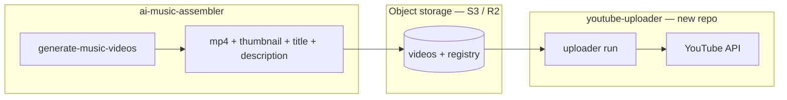
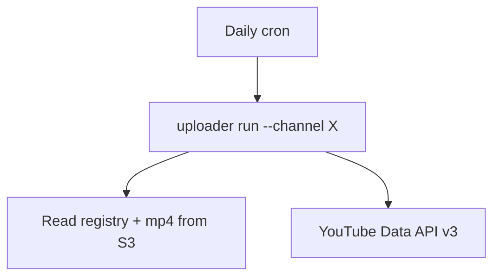

# YouTube Uploader Microservice — explanation

This document explains how to split **YouTube uploading** out of **ai-music-assembler** into a separate GitHub repository. For the full build spec (API contracts, repo layout, checklist), see **[YOUTUBE_UPLOADER_MICROSERVICE.md](./YOUTUBE_UPLOADER_MICROSERVICE.md)**.

---

## Why split?

**ai-music-assembler** is heavy: FFmpeg encoding, BiRefNet thumbnails, MP3 mixing, OpenAI/Gemini metadata. **YouTube uploading** is a different problem: OAuth, resumable uploads, scheduling, multi-channel tokens, retries, and queue management.

Separating them lets you:

- Run uploads on a **small cloud worker** (I/O bound, not 32 GB RAM)
- Manage **multiple YouTube channels** from one uploader service
- **Cron daily** upload jobs without keeping your Mac awake
- **Retry failures** independently of video rendering

---

## Service boundary



| Responsibility | ai-music-assembler | youtube-uploader |
|----------------|:------------------:|:----------------:|
| MP3 mix + video encode | ✅ | ❌ |
| Thumbnail render (rembg) | ✅ | ❌ |
| Title/description **generation** | ✅ | ❌ |
| Receive final title + description | ❌ | ✅ |
| YouTube OAuth (per channel) | ❌ | ✅ |
| Video upload + custom thumbnail | ❌ | ✅ |
| Schedule `publishAt` | ❌ | ✅ |
| Upload queue / registry | writes `pending` | owns lifecycle |
| List scheduled videos | ❌ | ✅ |
| Retry on timeout / 429 / 5xx | ❌ | ✅ |
| Multi-channel | ❌ | ✅ |

---

## What stays in ai-music-assembler

- `generate-music-videos` — full render pipeline
- `youtube_metadata.py` + `prompts/youtube_metadata.txt`
- Backgrounds, music library, FFmpeg, rembg
- Output folder: `music-video/mv_*/`

**After a video is built**, the assembler only needs to:

1. Upload files to object storage (or keep local paths for now)
2. Append a **pending** row to the upload registry **or** `POST` a job to the uploader API

It should **stop** calling `schedule-music-videos` once the uploader service is live.

---

## What moves to youtube-uploader (new repo)

### Source files to copy from this repo

| This repo | New repo module |
|-----------|-----------------|
| `music_assembler/youtube_upload.py` | `uploader/youtube_client.py` |
| `music_assembler/youtube_channel.py` | `uploader/channel_list.py` |
| `music_assembler/video_registry.py` | `uploader/registry.py` (generalized) |
| `music_assembler/schedule_music_videos.py` | `uploader/scheduler.py` |
| `music_assembler/progress_bars.py` | `uploader/progress.py` (optional) |

**Do not copy:** pipeline, ffmpeg, audio, metadata generation, segmentation.

### Core capabilities

1. **OAuth** — one Google client secret; one refresh token **per channel**
2. **Upload** — resumable insert + optional thumbnail (with retries)
3. **Schedule** — set `publishAt` (RFC3339 UTC); video starts private
4. **Registry** — track `pending` → `uploaded` / `failed`
5. **List** — all channel videos or `--scheduled-only`
6. **Multi-channel** — `channels.yaml` routes token + publish settings

---

## Job handoff (assembler → uploader)

Each finished video becomes one registry entry or API job:

```json
{
  "id": "mv_20260617_180732_01",
  "channel_id": "justcavefire",
  "status": "pending",
  "title": "Final YouTube title (from assembler metadata step)",
  "description": "Full description text with chapters",
  "video_uri": "s3://bucket/queue/justcavefire/job-001/video.mp4",
  "thumbnail_uri": "s3://bucket/queue/justcavefire/job-001/thumbnail.png"
}
```

The uploader downloads from `video_uri`, uploads to YouTube, sets schedule, marks `uploaded`.

---

## Multi-channel setup

Channels are registered dynamically — no hardcoded `channel-a` / `channel-b`:

```bash
uploader channel add    # OAuth in browser; id = @handle or channel name
uploader channel list
```

```yaml
# config/channels.yaml (auto-populated by channel add)
channels:
  - id: justcavefire
    name: Cavefire
    youtube_channel_id: UC...
    custom_url: '@justcavefire'
    token_path: s3://bucket/secrets/justcavefire/youtube_token.json   # or local path
    registry_path: s3://bucket/state/justcavefire/upload_registry.txt
    publish:
      timezone: America/New_York
      hour: 9
      interval_hours: 24

google:
  oauth_port: 8765
```

Google OAuth credentials go in `.env` (`GOOGLE_CLIENT_ID`, `GOOGLE_CLIENT_SECRET`). Authorize each channel once; tokens persist in R2 when `CLOUDFLARE_R2_BUCKET` is set.

---

## How it runs in production



| Component | Uploader needs | Assembler needs |
|-----------|----------------|-----------------|
| Worker VM | 2–4 vCPU, 4–8 GB RAM | 32 GB RAM for encode |
| Storage | Read videos + registry | Write videos + pending jobs |
| Scheduler | Cron per channel | Cron for daily **build** |
| Secrets | OAuth tokens per channel | OpenAI/Gemini keys only |

---

## Cloudflare R2 bucket layout

When `CLOUDFLARE_R2_BUCKET` is configured, durable state lives in R2:

```
{bucket}/config/channels.yaml
{bucket}/secrets/{channel_id}/youtube_token.json
{bucket}/state/{channel_id}/channel.meta.json
{bucket}/state/{channel_id}/upload_registry.txt
{bucket}/queue/{channel_id}/{job_id}/
  video.mp4, thumbnail.png, title.txt, description.txt
  metadata.json, privacy.txt, is_short.txt, manifest.json
{bucket}/uploaded/{channel_id}/{job_id}/   # archived after YouTube upload
```

Initialize with `uploader storage init`. Stage with `uploader queue add`. Defaults: `.env` `UPLOADER_DEFAULT_*` → `channels.yaml` `defaults:` → per-channel → CLI flags.

## CLI commands (youtube-uploader repo)

Activate `.venv` then use `uploader …` (entry point: `pyproject.toml` → `cli.main:main`).

### Channels & auth

| Command | Description |
|---------|-------------|
| `uploader channel add` | OAuth in browser; save channel by @handle or name |
| `uploader channel list` | List configured channels |
| `uploader channel reauth <ref>` | Re-authenticate one channel |
| `uploader channels` | Alias for `channel list` |

### Storage

| Command | Description |
|---------|-------------|
| `uploader storage init` | Create R2/local layout; migrate existing data |

### Queue & scheduler

| Command | Description |
|---------|-------------|
| `uploader queue add --channel X --video PATH --title "…"` | Stage job folder to `queue/` + `pending` registry row |
| `uploader plan --channel X` | Preview publish schedule (dry run) |
| `uploader run --channel X` | Upload all pending jobs for one channel |
| `uploader run-all` | Upload pending jobs for every channel |
| `uploader list --channel X [--scheduled-only]` | List videos on YouTube |

### Direct upload & testing

| Command | Description |
|---------|-------------|
| `uploader test --channel X --video PATH` | Quick private test upload |
| `uploader upload --channel X --video PATH` | Single direct upload |
| `uploader enqueue …` | Append registry row (when URIs already exist) |

**Example — stage then run:**

```bash
uploader queue add --channel justcavefire \
  --video ./my-video.mp4 --title "My Title" --description "…"

uploader plan --channel justcavefire --start "2026-06-21 09:00" --interval-hours 24
uploader run --channel justcavefire --upload-retries 5
uploader list --channel justcavefire --scheduled-only
```

**Daily cron example:**

```cron
0 3 * * * /path/to/scripts/run-channel.sh justcavefire
0 4 * * * /path/to/scripts/run-channel.sh mmmactually
# or: scripts/run-all-channels.sh
```

---

## Implementation phases

| Phase | Deliverable |
|-------|-------------|
| **1** | CLI worker: `queue add`, `run`, R2 storage, job metadata + defaults |
| **2** | Assembler writes S3 URIs + pending jobs; cron on one VM |
| **3** | HTTP API (`POST /v1/jobs`), Postgres registry, secrets manager |
| **4** | Idempotency, quota tracking, alerts on failure |

---

## Google Cloud / YouTube requirements

- Google Cloud project with **YouTube Data API v3** enabled
- OAuth consent screen + OAuth client (Desktop for dev, Web for prod)
- One **verified YouTube channel** per `channel_id` (for custom thumbnails)
- Upload quota: ~6 videos/day default per project unless extended

---

## Commands today vs after split

**Today (everything in this repo):**

```bash
generate-music-videos -n 1 --thumbnail-text "OMYO" --workers 2
schedule-music-videos --start "2026-06-21 09:00" --interval-hours 24
list-youtube-videos --scheduled-only
```

**After split:**

```bash
# ai-music-assembler
generate-music-videos -n 1 --thumbnail-text "OMYO" --workers 2
# → sync to S3 + write pending registry row

# youtube-uploader (new repo)
uploader run --channel justcavefire --upload-retries 5
uploader run-all
uploader list --channel justcavefire --scheduled-only
```

---

## Related docs in this repo

| File | Contents |
|------|----------|
| **[YOUTUBE_UPLOADER_MICROSERVICE.md](./YOUTUBE_UPLOADER_MICROSERVICE.md)** | Full build spec: API shapes, repo layout, checklist, YouTube API details |
| **[FUTURE_PLAN.md](./FUTURE_PLAN.md)** | End-to-end hosting (storage, cron, multi-channel platform) |
| `music-video/video_registry.txt` | Example pending/uploaded registry format today |
