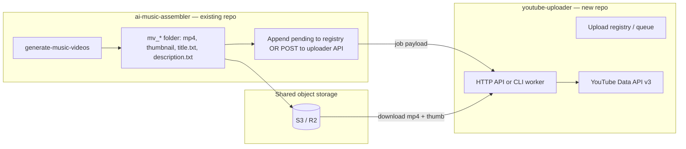

# YouTube Uploader Microservice — build spec

Export this document to your new GitHub repository. It abstracts everything upload-related from **ai-music-assembler** and defines what the microservice owns vs what stays in the assembler.

---

## Boundary: two services



| Responsibility | **ai-music-assembler** | **youtube-uploader** |
|----------------|------------------------|----------------------|
| MP3 mix, encode, thumbnail render | ✅ | ❌ |
| Title/description **generation** (OpenAI/Gemini) | ✅ | ❌ (receives final strings) |
| Background images | ✅ | ❌ |
| YouTube OAuth per channel | ❌ | ✅ |
| Resumable video upload | ❌ | ✅ |
| Custom thumbnail upload | ❌ | ✅ |
| Schedule `publishAt` | ❌ | ✅ |
| Upload queue / registry | ❌ (writes `pending`) | ✅ (owns lifecycle) |
| List scheduled videos on channel | ❌ | ✅ |
| Retry on timeout / 429 / 5xx | ❌ | ✅ |
| Multi-channel routing | ❌ | ✅ |

---

## What to copy from this repo

Lift these modules almost verbatim (rename package, remove `music_assembler` imports):

| Source file | New module | Notes |
|-------------|------------|-------|
| `music_assembler/youtube_upload.py` | `uploader/youtube_client.py` | OAuth, `upload_video`, retries, thumbnail prep |
| `music_assembler/youtube_channel.py` | `uploader/channel_list.py` | `list_channel_videos`, `YouTubeVideoInfo` |
| `music_assembler/video_registry.py` | `uploader/registry.py` | Generalize schema (see below) |
| `music_assembler/schedule_music_videos.py` | `uploader/scheduler.py` + CLI | Batch upload loop; drop music-specific paths |
| `music_assembler/progress_bars.py` | `uploader/progress.py` | Optional; CLI only |

**Do not copy:** `pipeline.py`, `ffmpeg_util.py`, `youtube_metadata.py`, `make_music_videos.py`, segmentation, audio, etc.

### Python dependencies (new repo `pyproject.toml`)

```toml
dependencies = [
    "google-api-python-client>=2.100.0",
    "google-auth-oauthlib>=1.2.0",
    "google-auth-httplib2>=0.2.0",
    "Pillow>=10.0.0",          # thumbnail resize only
    "python-dotenv>=1.0.0",    # optional
]

[project.optional-dependencies]
api = ["fastapi>=0.110", "uvicorn>=0.27", "pydantic>=2.0"]
s3 = ["boto3>=1.34"]
```

---

## Core library API (implement first)

These are the functions your CLI, cron worker, and HTTP API wrap.

### 1. OAuth

```python
def get_credentials(
    client_secret: Path,
    token_path: Path,
    *,
    oauth_port: int = 8080,
) -> Credentials:
    """Load/refresh token; browser flow on first run."""

SCOPES = ["https://www.googleapis.com/auth/youtube.upload"]
```

- One **Google Cloud OAuth client** (Desktop or Web) shared across channels.
- One **`youtube_token.json` per channel** (refresh token).

### 2. Single upload

```python
def upload_video(
    video_path: Path,
    *,
    title: str,
    description: str,
    client_secret: Path,
    token_path: Path,
    privacy: str = "private",       # private | unlisted | public
    category_id: str = "10",          # Music
    tags: list[str] | None = None,
    made_for_kids: bool = False,
    thumbnail_path: Path | None = None,
    publish_at: str | None = None,   # RFC3339 UTC e.g. 2026-06-20T13:00:00Z
    oauth_port: int = 8080,
    on_progress: Callable[[float], None] | None = None,
) -> dict:
    """Returns YouTube insert response; includes 'id'."""
```

**Scheduling rule:** if `publish_at` is set → force `privacyStatus=private` + set `status.publishAt` (YouTube requirement).

**Thumbnail rule:** best-effort; never fail upload if thumbnail fails (verified channel required).

### 3. Upload with retries

```python
def upload_video_with_retry(
    video_path: Path,
    *,
    max_attempts: int = 3,
    retry_delay_sec: float = 30.0,  # linear: delay * attempt
    on_retry: Callable[[int, int, Exception], None] | None = None,
    **upload_kwargs,
) -> dict:

def is_transient_upload_error(exc: BaseException) -> bool:
    """Timeouts, connection errors, HTTP 408/429/5xx."""
```

### 4. List channel videos

```python
@dataclass
class YouTubeVideoInfo:
    video_id: str
    title: str
    privacy_status: str
    publish_at: str | None
    url: str

    @property
    def is_scheduled(self) -> bool: ...

def list_channel_videos(
    client_secret: Path,
    token_path: Path,
    *,
    scheduled_only: bool = False,
) -> list[YouTubeVideoInfo]:
    """channels.list → uploads playlist → videos.list (batched by 50)."""
```

---

## Upload registry (generalized schema)

Replace music-specific fields with storage-agnostic URIs. Store in S3 or Postgres.

### JSON-lines entry (compatible with assembler today)

```json
{
  "id": "mv_20260617_180732_01",
  "channel_id": "channel-a",
  "status": "pending",
  "title": "𝐏𝐥𝐚𝐲𝐥𝐢𝐬𝐭 …",
  "description": "Full description text OR s3://bucket/path/description.txt",
  "video_uri": "s3://bucket/videos/channel-a/mv_…/video.mp4",
  "thumbnail_uri": "s3://bucket/videos/channel-a/mv_…/thumbnail.png",
  "youtube_id": "",
  "youtube_url": "",
  "publish_at": "",
  "created_at": "2026-06-17T18:07:32Z",
  "uploaded_at": "",
  "error": "",
  "extra": {}
}
```

| Field | Required | Notes |
|-------|----------|-------|
| `id` | ✅ | Unique job id from assembler |
| `channel_id` | ✅ | Routes OAuth token + config |
| `status` | ✅ | `pending` → `uploading` → `uploaded` \| `failed` |
| `title` | ✅ | Final YouTube title (assembler generates) |
| `description` | ✅ | Inline text or URI to `.txt` |
| `video_uri` | ✅ | `file://`, `s3://`, `gs://`, or local path |
| `thumbnail_uri` | optional | |
| `publish_at` | optional | Set by scheduler before upload |
| `youtube_id` | set on success | |

### Registry operations

```python
class UploadRegistry:
    def pending(self, channel_id: str | None = None) -> list[UploadEntry]: ...
    def mark_uploading(self, entry_id: str) -> None: ...
    def mark_uploaded(self, entry_id: str, *, youtube_id: str, publish_at: str = "") -> None: ...
    def mark_failed(self, entry_id: str, *, error: str) -> None: ...
    def append(self, entry: UploadEntry) -> None: ...
```

**Storage backends (pick one for v1):**

1. **JSON-lines file** in S3 (`state/{channel}/upload_registry.txt`) — same as today
2. **PostgreSQL** — better for API + concurrent workers
3. **SQS queue** — message per job; registry optional

---

## Job payload (assembler → uploader contract)

When the assembler finishes a video, it sends:

```json
POST /v1/jobs
{
  "id": "mv_20260617_180732_01",
  "channel_id": "channel-a",
  "title": "...",
  "description": "...",
  "video_uri": "s3://my-bucket/videos/channel-a/mv_20260617_180732_01/video.mp4",
  "thumbnail_uri": "s3://my-bucket/videos/channel-a/mv_20260617_180732_01/thumbnail.png",
  "schedule": {
    "mode": "next_slot",
    "timezone": "America/New_York",
    "hour": 9,
    "interval_hours": 24
  },
  "tags": ["lofi", "chill"],
  "category_id": "10",
  "made_for_kids": false
}
```

Or assembler appends to shared registry file; uploader cron polls `pending`.

**Assembler changes (minimal):**

- After `generate-music-videos`, write `video_uri` as S3 path instead of local path (or uploader resolves local mount).
- Stop calling `schedule-music-videos` locally; call uploader API or drop row in shared registry.

---

## Multi-channel config

```yaml
# config/channels.yaml
channels:
  - id: channel-a
    name: "Late Night Lofi"
    youtube_channel_id: UCxxxx          # optional; for validation
    token_secret: secrets/channel-a/youtube_token.json
    default_tags: [lofi, chill, study]
    category_id: "10"
    publish:
      timezone: America/New_York
      hour: 9
      interval_hours: 24

  - id: channel-b
    name: "K-R&B Mood"
    token_secret: secrets/channel-b/youtube_token.json
    publish:
      timezone: America/New_York
      hour: 12
      interval_hours: 24

google:
  client_secret: secrets/shared/google_oauth_client.json
  oauth_port: 8080
```

---

## Microservice surfaces

Implement in phases.

### Phase 1 — CLI worker (fastest path)

Same UX as today’s `schedule-music-videos`:

```bash
# Process all pending for one channel
uploader run --channel channel-a --registry s3://bucket/state/channel-a/upload_registry.txt

# Dry-run schedule plan
uploader plan --channel channel-a --start "2026-06-21 09:00" --interval-hours 24

# List scheduled on YouTube
uploader list --channel channel-a --scheduled-only

# One-off OAuth (run on laptop once per channel)
uploader auth --channel channel-a
```

**Daily cron (on worker VM):**

```cron
0 3 * * * uploader run --channel channel-a --upload-retries 5 >> /var/log/uploader/a.log 2>&1
0 4 * * * uploader run --channel channel-b --upload-retries 5 >> /var/log/uploader/b.log 2>&1
```

### Phase 2 — HTTP API

| Method | Path | Purpose |
|--------|------|---------|
| `POST` | `/v1/jobs` | Enqueue upload (assembler calls this) |
| `GET` | `/v1/jobs/{id}` | Job status |
| `GET` | `/v1/jobs?channel=&status=pending` | List queue |
| `POST` | `/v1/channels/{id}/run` | Process pending batch now |
| `GET` | `/v1/channels/{id}/scheduled` | Proxy to `list_channel_videos(scheduled_only=True)` |
| `POST` | `/v1/channels/{id}/auth/start` | OAuth URL for channel setup |

Auth between services: API key or mTLS (assembler → uploader).

### Phase 3 — Worker pulls from queue

- SQS / Redis queue; horizontal upload workers
- One encode-sized video upload per worker; no parallel uploads per channel (quota + bandwidth)

---

## Scheduler logic (port from `schedule_music_videos.py`)

For each `pending` entry in order:

1. Resolve `description` (inline or fetch from URI).
2. Download `video_uri` + `thumbnail_uri` to temp dir (if remote).
3. Compute `publish_at`:
   - **Explicit:** from job or `--start` + index × `--interval-hours`
   - **Auto slot:** next free day at channel’s publish hour (query YouTube scheduled list to avoid collisions — optional v2)
4. Call `upload_video_with_retry(...)`.
5. `mark_uploaded` or `mark_failed`.
6. Delete temp files.

**Publish time format:** local `--start` → convert to RFC3339 UTC:

```python
def to_rfc3339_utc(dt: datetime) -> str:
    return dt.astimezone(timezone.utc).strftime("%Y-%m-%dT%H:%M:%SZ")
```

---

## Secrets & Google Cloud setup

### Required accounts

| Item | Purpose |
|------|---------|
| Google Cloud project | YouTube Data API v3 |
| YouTube channel(s) | Destination |
| Object storage | Shared with assembler (video files) |
| Secrets manager | Prod tokens |

### One-time per Google Cloud project

1. Enable **YouTube Data API v3**
2. OAuth consent screen (External or Internal)
3. Create OAuth client:
   - **Dev:** Desktop app (browser on laptop) → `uploader auth`
   - **Prod:** consider Web app + stored refresh tokens in Secrets Manager
4. Download `client_secret.json`

### Per YouTube channel

1. Run `uploader auth --channel X` (browser login as that channel’s Google account)
2. Store resulting refresh token at `secrets/channel-X/youtube_token.json`
3. **Verified channel** for custom thumbnails

### Environment variables

```bash
GOOGLE_CLIENT_SECRET_PATH=/secrets/shared/google_oauth_client.json
CLOUDFLARE_R2_BUCKET=your-bucket
CLOUDFLARE_R2_ENDPOINT_URL=https://<account_id>.r2.cloudflarestorage.com
CLOUDFLARE_R2_REGION=auto
CLOUDFLARE_R2_ACCESS_KEY_ID=...
CLOUDFLARE_R2_SECRET_ACCESS_KEY=...
UPLOADER_API_KEY=...                    # if HTTP API
```

---

## Infrastructure (uploader only)

```mermaid
flowchart TB
  subgraph assembler_repo [ai-music-assembler]
    GMV[generate-music-videos]
  end

  subgraph shared [Object storage]
    VID[videos/{channel}/mv_*/]
    REG[state/{channel}/upload_registry.txt]
    SEC[secrets/{channel}/youtube_token.json]
  end

  subgraph uploader_repo [youtube-uploader service]
    CRON[cron or Cloud Scheduler]
    WORKER[uploader run]
    API[FastAPI optional]
  end

  GMV -->|writes mp4 + pending job| VID
  GMV -->|append pending| REG
  CRON --> WORKER
  WORKER -->|read| REG & VID & SEC
  WORKER -->|upload| YT[YouTube API]
```

| Component | Spec |
|-----------|------|
| **Worker VM** | Small OK: 2 vCPU, 4–8 GB RAM (upload is I/O bound; ~200–400 MB/video) |
| **Storage** | Read videos from S3; sync registry R/W |
| **Scheduler** | Cron per channel, staggered |
| **Secrets** | AWS Secrets Manager / GCP Secret Manager |
| **Logs** | Structured JSON; alert on `failed` status |
| **Network** | Stable egress; large upload timeouts (15–60 min per video) |

**Not required on uploader:** FFmpeg, rembg, Gemini, OpenAI, 32 GB RAM.

---

## Suggested new repo layout

```
youtube-uploader/
├── pyproject.toml
├── README.md
├── config/
│   └── channels.yaml.example
├── uploader/
│   ├── __init__.py
│   ├── youtube_client.py      # from youtube_upload.py
│   ├── channel_list.py        # from youtube_channel.py
│   ├── registry.py            # generalized VideoRegistry
│   ├── scheduler.py           # batch run loop
│   ├── storage.py             # s3:// download, local temp
│   ├── channels.py            # load channels.yaml
│   ├── retry.py               # is_transient_upload_error (or inline)
│   └── progress.py            # optional MultiProgress
├── cli/
│   └── main.py                # uploader run | plan | list | auth
├── api/
│   └── app.py                 # FastAPI Phase 2
├── scripts/
│   └── run-channel.sh         # cron entrypoint
└── tests/
    ├── test_registry.py
    ├── test_scheduler.py
    └── test_retry.py
```

---

## Implementation checklist

### Phase 1 — Library + CLI (week 1)

- [ ] New repo, copy core modules, fix imports
- [ ] Generalized `UploadEntry` + `UploadRegistry` (file-backed)
- [ ] `storage.py`: resolve `s3://` and `file://` to local Path
- [ ] CLI: `auth`, `run`, `plan`, `list`
- [ ] `channels.yaml` loader
- [ ] Integration test with one private upload (unlisted test video)

### Phase 2 — Assembler integration (week 2)

- [ ] Assembler writes `upload_registry.txt` with `video_uri` (S3 paths)
- [ ] Document contract in both READMEs
- [ ] Cron on one VM: assembler builds overnight → uploader runs at 06:00
- [ ] Remove `schedule-music-videos` from assembler default workflow (optional deprecation)

### Phase 3 — HTTP API + multi-channel (week 3–4)

- [ ] FastAPI `POST /v1/jobs`
- [ ] Postgres registry option
- [ ] Secrets manager for tokens
- [ ] Health check + `list scheduled` endpoint
- [ ] Alerting on failures

### Phase 4 — Hardening

- [ ] Idempotency: skip if `youtube_id` already set
- [ ] Resume partial uploads (YouTube resumable protocol already in client)
- [ ] Quota tracking (YouTube daily upload limit)
- [ ] Admin UI or Slack notification on failure

---

## YouTube API reference (implementation details)

| Operation | API call |
|-----------|----------|
| Upload video | `videos().insert(part="snippet,status", media_body=resumable)` |
| Set thumbnail | `thumbnails().set(videoId=…)` |
| List uploads | `channels().list(mine=True)` → `playlistItems().list(uploads playlist)` |
| Video metadata | `videos().list(part="snippet,status", id=…)` |
| Schedule publish | `status.publishAt` + `privacyStatus=private` on insert |

**Quota:** ~1,600 units per upload; default 10,000 units/day per project — ~6 uploads/day unless quota extension requested.

**Chunk size:** 8 MB (`MediaFileUpload(..., chunksize=8*1024*1024, resumable=True)`).

---

## What assembler keeps (no duplication)

- `generate-music-videos` — full render pipeline
- `youtube_metadata.py` — title/description generation
- `prompts/youtube_metadata.txt`
- Backgrounds, music library, ffmpeg, rembg
- Local `music-video/mv_*/` output structure

**Assembler output handoff:** each completed run produces files + one registry row (or HTTP POST) with **final** title, description, video URI, thumbnail URI, and `channel_id`.

---

## Quick reference — commands after split

**Assembler (existing repo):**

```bash
generate-music-videos -n 1 --thumbnail-text "OMYO" --workers 2
# → writes to S3 + appends pending row (you add S3 sync)
```

**Uploader (new repo):**

```bash
uploader auth --channel channel-a
uploader plan --channel channel-a --start "2026-06-21 09:00" --interval-hours 24
uploader run --channel channel-a --upload-retries 5
uploader list --channel channel-a --scheduled-only
```

---

## Files in this repo to use as source

When copying, start from these paths in **ai-music-assembler**:

- `music_assembler/youtube_upload.py`
- `music_assembler/youtube_channel.py`
- `music_assembler/video_registry.py`
- `music_assembler/schedule_music_videos.py` (scheduler loop only)
- `music_assembler/progress_bars.py` (optional)

Example registry row today: `music-video/video_registry.txt`.
